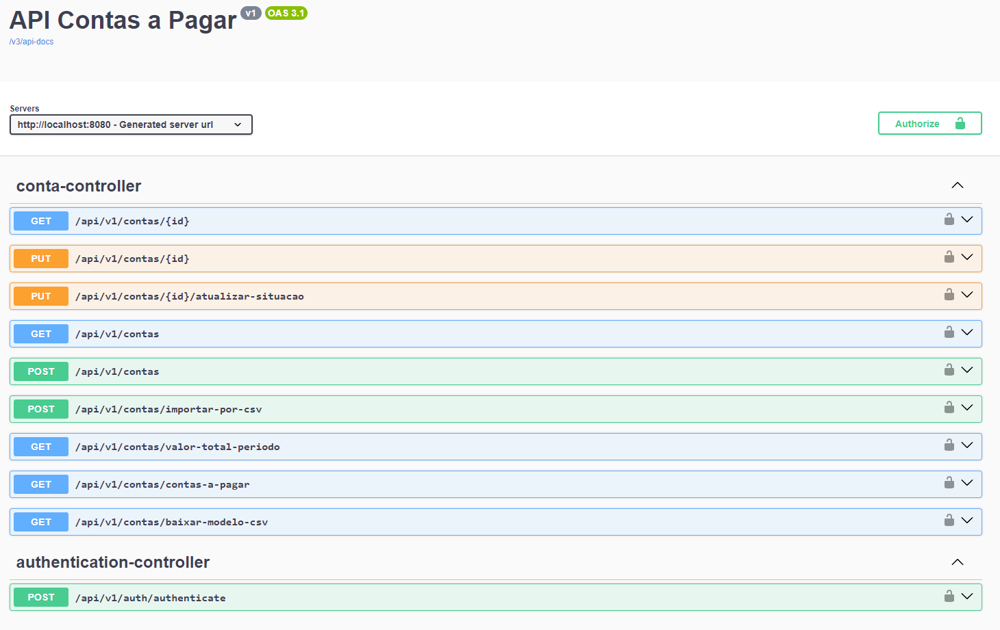
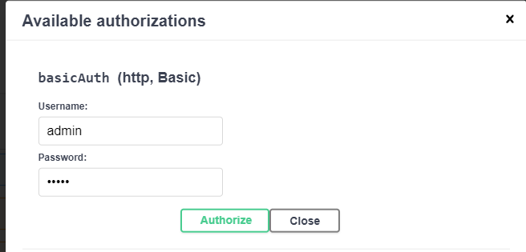
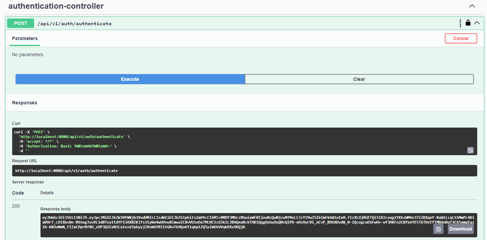
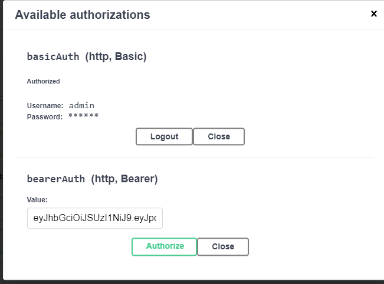
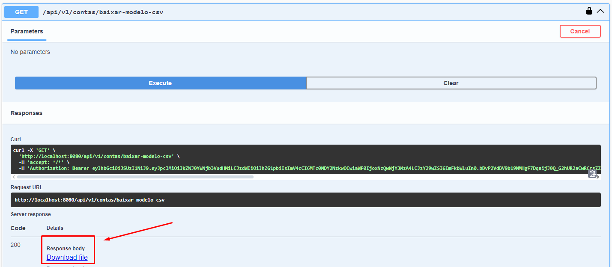
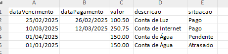
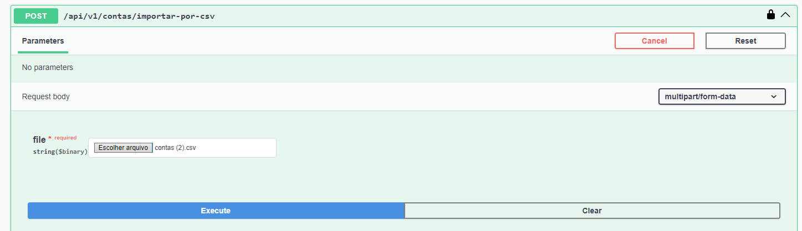
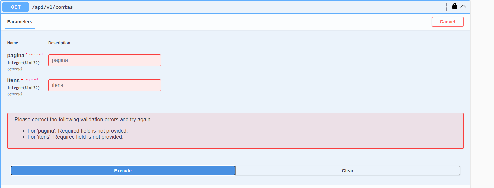
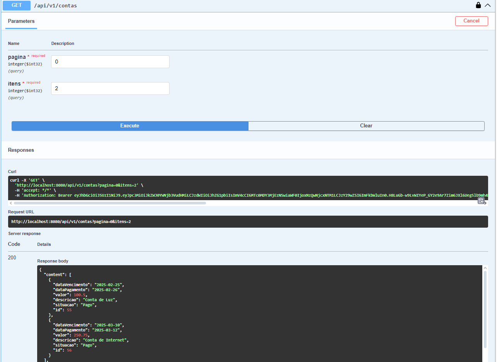
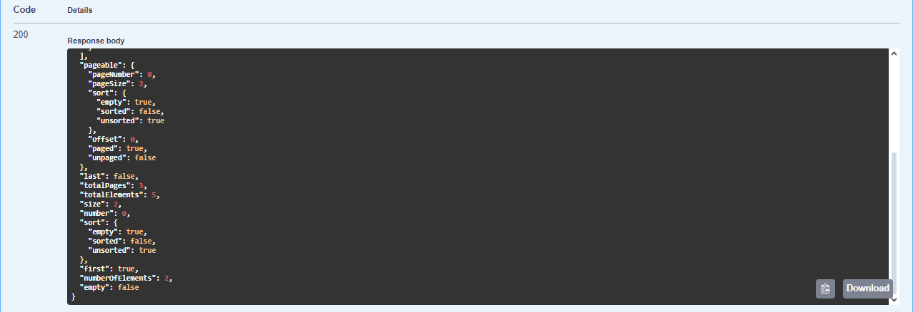

<h1 align="center">
  Spring Security JWT
</h1>

Romano de Conto Pasqualotto - [Linkedin](www.linkedin.com/in/romano-de-conto-pasqualotto)

## Intro

Aplicação Web Api Rest de gerenciamento de contas.
- documentação swagger
- implementação de autenticação basic (para acesso a rota de autenticação)
- implementação de autenticação jwt
- implementação de importação de dados via csv
- implementação de testes unitários
- utilizando versões mais atualizadas das tecnologias.



## Tecnologias

* [Java 23](https://www.oracle.com/java/technologies/javase-jdk23-doc-downloads.html)
* [Postgres Sql](https://www.postgresql.org/docs/)
* [Official Apache Maven documentation](https://maven.apache.org/guides/index.html)
* [Spring Boot Maven Plugin Reference Guide](https://docs.spring.io/spring-boot/3.4.3/maven-plugin)
* [Create an OCI image](https://docs.spring.io/spring-boot/3.4.3/maven-plugin/build-image.html)
* [Spring Web](https://docs.spring.io/spring-boot/3.4.3/reference/web/servlet.html)
* [Spring Doc](https://springdoc.org)
* [Spring Data JPA](https://docs.spring.io/spring-boot/3.4.3/reference/data/sql.html#data.sql.jpa-and-spring-data)
* [Spring Security](https://spring.io/projects/spring-security)
* [Testcontainers](https://docs.spring.io/spring-boot/reference/testing/testcontainers.html)
* [Opencsv](https://opencsv.sourceforge.net)
* [OAuth 2.0 Resource Server](https://docs.spring.io/spring-security/reference/servlet/oauth2/resource-server/index.html)
* [Flyway Migration](https://docs.spring.io/spring-boot/3.4.3/how-to/data-initialization.html#howto.data-initialization.migration-tool.flyway)
* [Docker Compose Support](https://docs.spring.io/spring-boot/3.4.3/reference/features/dev-services.html#features.dev-services.docker-compose)

## Como debugar com intellij

- Clonar repositório git:

```git clone https://github.com/romanoConto/contas-a-pagar.git```

- Instalar o apache-maven-3.9.9
```https://maven.apache.org/download.cgi```

- Instalar o Java 23-jdk
```https://www.oracle.com/br/java/technologies/downloads/#java23```

- Instalar o docker
```https://www.docker.com```

- Instalar o docker-compose 
```https://docs.docker.com/compose/ ```

- Debugar pela IDE ou executar pelo comando
```mvn sprin-boot:run```

## Como gerar artefato e rodar api no docker:

Para coseguir executar o comando mvn clean install é necessario ter o banco de dados no ar, entao para conseguir gerar o artefato, e depois rodar toda a aplicação em um unico container, vamos precisar de dois terminais e executar na sequencia correta.

- Abrir 2 terminais
- No terminal 1 executar o comando para subir o banco de dados:
```docker-compose up```

- No terminal 2 executar para gerar o artefato:
```mvn clean install```

- No terminal 1 parar a execução do docker com o comando:
```ctrl+c```

- No terminal 2 executar o comando para gerar a imagem do docker:
```docker build -t contas-a-pagar-api .```

- No terminal 2 executar a api:
```docker-compose -f compose-api.yaml up --build```

## Autenticar na api via swagger

- Acessar o swagger
```http://localhost:8080/swagger-ui/index.html#```

- Utilizar as credenciais do usuario inicial (utilizar autenticação basic)
- usuario e senha:
```usuario:admin```
```senha:admin```



- Apos adicionar as credenciais basic, fazer requisicao para obter o jwt para utilizar demais endpoints
```/api/v1/auth/authenticate```



- Apos obter o jwt do enpoint authenticate, adicionar na autenticação bearerAuth 



- Com isso está autenticado para utilizar todos enpoints!

## Importar dados via csv
- Autenticar seguindo a etapa anterior

- Fazer requisição para baixar o arquivo modelo do csv pelo enpoint:
```/api/v1/contas/baixar-modelo-csv```



- Abrir arquivo e inserir dados mantendo o padrão (dataVencimento, dataPagamento, valor, descricao, situacao).



- O único campo que pode ficar em branco é o dataPagamento.
- No campo situação, pode ter os seguintes valores:
```Atrasado```
```Pago```
```Pendente```

- Adicionar arquivo csv e fazer importação pelo enpoint



## Listando contas
- Para listar as contas, deve ser feita requisição para o enpoint
```/api/v1/contas```
- Os parametros de paginação sao obrigatórios



- Para acessar a primeira página, basta enviar 0 e adicionar o numero de itens desejado



- Junto com os dados solicitados, a api retorna informações sobre paginação



```{
  "content": [
    {
      "dataVencimento": "2025-02-25",
      "dataPagamento": "2025-02-26",
      "valor": 100.5,
      "descricao": "Conta de Luz",
      "situacao": "Pago",
      "id": 55
    },
    {
      "dataVencimento": "2025-03-10",
      "dataPagamento": "2025-03-12",
      "valor": 250.75,
      "descricao": "Conta de Internet",
      "situacao": "Pago",
      "id": 56
    }
  ],
  "pageable": {
    "pageNumber": 0,
    "pageSize": 2,
    "sort": {
      "empty": true,
      "sorted": false,
      "unsorted": true
    },
    "offset": 0,
    "paged": true,
    "unpaged": false
  },
  "last": false,
  "totalPages": 3,
  "totalElements": 5,
  "size": 2,
  "number": 0,
  "sort": {
    "empty": true,
    "sorted": false,
    "unsorted": true
  },
  "first": true,
  "numberOfElements": 2,
  "empty": false
}```